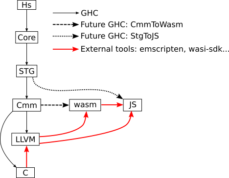

# Compiling Haskell to JavaScript and WebAssembly

JavaScript platforms have become the de facto way to distribute portable programs: almost every system has an up-to-date JavaScript VM installed: a Web browser. The “JavaScript problem” is that we don’t want to use JavaScript – a programming language with many deficiencies – but we have to in order to use JavaScript platforms. This document is about one solution to this problem, namely compiling a better language (Haskell) to target JavaScript platforms.

Some deficiencies of JavaScript platforms have been recognized and addressed by adding JavaScript features (e.g. support for tail recursion optimisation), by recognizing specific patterns in JS codes (cf asm.js), or by extending JavaScript platforms with a different language (WebAssembly). In addition, some JavaScript platforms (e.g. NodeJS) supports native extensions, hence we could imagine extensions dedicated to supporting some aspects of JavaScript codes generated from Haskell.

Using JavaScript extensions may offer different trade-offs (e.g. performance vs portability). As we don’t believe there will be a definite answer for every use-case, we will try to keep this document up to date with developments of JavaScript platforms and with their induced trade offs for a Haskell compiler targeting them.

# Overview

Here is an overview of the compilation pipeline, showing the different intermediate representations:

- StgToJS was implemented in GHCJS project but isn't upstreamed yet
- CmmToWasm was implemented in Asterius project but isn't upstreamed yet

# RTS

GHC's RTS is written in C/Cmm. Hence there are two solutions:

|         | Compile C RTS into JS/wasm with external toolchain | Implement custom JS/wasm RTS       |
| ------- | -------------------------- | ---------------------------------- |
| Cost    | Adapt existing code (avoid signals, avoid some syscalls, etc.) | Has to be implemented from scratch |
| ABI     | Forced on us by external tools (emscripten, wasi-sdk...) | Full control by GHC devs |
| Used by | wasm32-wasi-ghc, WebGHC    | JS backend, GHCJS, Asterius |

# Approaches

There are currently (2022) two active lines of work:

- JS backend:
  - Details: https://gitlab.haskell.org/ghc/ghc/-/wikis/JavaScript-backend
  - Target : JavaScript
  - Haskell codes: implementing StgToJS backend, reusing code from GHCJS project
  - RTS: custom JS RTS, reusing code from GHCJS project

- wasm32-wasi-ghc:
    - Details: https://gitlab.haskell.org/ghc/ghc/-/wikis/WebAssembly-backend 
    - Target : WebAssembly + optional JS for foreign exports
    - Haskell codes: implementing CmmToWasm backend
    - RTS: use C to WebAssembly toolchain (wasi-sdk) to compile C RTS into wasm.

Inactive approaches:

- GHCJS:
    - https://github.com/ghcjs/ghcjs
    - Target : JavaScript
    - Haskell codes: implementing StgToJS backend, reusing code from GHCJS project
    - RTS: custom JS RTS, reusing code from GHCJS project
    - Status: stuck at GHC 8.10; replaced by JS backend

- Asterius
    - https://github.com/tweag/asterius 
    - Target: WebAssembly + JS for foreign exports
    - Haskell codes: converted from Cmm to wasm
    - RTS: custom JS RTS
    - Status: now abandoned in favour of wasm32-wasi-ghc

- WebGHC
    - Target: WebAssembly
    - Haskell codes: relies on LLVM backend, then LLVM to wasm external toolchain
    - RTS: use C to WebAssembly toolchain (emscripten) to compile C RTS into wasm.
    - Status: abandoned since 2017 SoC: https://webghc.github.io/2017/08/10/hsocwrapup.html

# Compiling Haskell code (lazy graph reduction)

GHC’s main task is to generate code that implements lazy graph reduction for Haskell programs. GHC has been designed to produce efficient code on native platforms. The challenge here is to determine what needs to change to target:

- JavaScript: a managed platform which has its own garbage collector
- WebAssembly: stack based very constrained abstract machine

Sadly there is no comprehensive documentation of GHC’s design to refer to. Hence we can’t just mention what a JavaScript backend has to do differently, but also what the other backends  (native code generator, interpreter, etc.) do.

Efficient lazy graph reduction is only one aspect of compiling Haskell codes. Most of the challenges come from the “Awkward squad” support (IO, concurrency, exceptions, FFI imports and exports), support for GHC’s features violating abstraction layers (weak references, stable pointers, explicit call to the GC, etc.), compile time code execution (Template Haskell, annotations, compiler plugins), support for interacting with C codes compiled into JavaScript too!

## Eval/apply for JS
https://www.cs.tufts.edu/comp/150FP/archive/simon-peyton-jones/eval-apply-jfp.pdf 
Do we need to generate “stg_app_*” for JS targets? We could probably use `typeof` to detect if an object is a closure or an unboxed value.

## Tail calls

Tail calls are commonly used in GHC’s generated code for native platforms. Evaluating a thunk is efficiently done by jumping to its entry code. That is one of the reasons it is fast.

Initially JavaScript didn’t support tail calls. Since ES6 it should support it in theory. However some JS platforms disabled it because it makes debugging more difficult (see https://github.com/nodejs/CTC/issues/3, https://github.com/tc39/proposal-ptc-syntax/issues/23).

Similarly for WebAssembly, there is a proposal to add support for tail calls (https://github.com/webassembly/tail-call) which isn’t well supported. See https://leaningtech.com/extreme-webassembly-2-the-sad-state-of-webassembly-tail-calls/ for the status in 2020 as well as links to issues that are often still open in 2022.

A slower alternative to tail calls is to use trampolines: instead of being (tail) called, the function to call is returned to its caller which will just call it… The top-level function is a loop that calls returned functions. This was the solution implemented in Asterius. GHCJS and the GHC via-C backend also use trampolines.

# Awkward squad and more

## Template Haskell

Ghcjs pioneered the external interpreter (iserv): run JS code in NodeJS

Alternatives: fat interfaces + stg/bytecode interpreter

## Plugins

Can’t load plugins in cross-compiler (need to link with host RTS, e.g. for GHC’s global vars)
GHC not multi-target, even just for loading plugins for a different target (the compiler host), lest compiling plugins

## Setup.hs

Cabal’s Setup.hs must be run on the host
Two approaches:
- Compile to JS and run with nodejs
- Compile to host native (need different toolchain than for the target)

## Garbage collection

Reusing JavaScript’s garbage collector (e.g. ghcjs) or not (e.g. Asterius)?

Approaches that reuse the native RTS benefit from the native GC implementations (non-moving, staged, etc.).
- Do they make sense for a JS/WebAssembly target?
- Is block memory allocation sensible?

## Concurrency

- Support for light threads and concurrency primops
- STM

## C/Cmm sources

Many Haskell packages come with C source files.

- Use external toolchains (empscripten, wasi-sdk...) to compile them into wasm/JS
  - easy when for approaches that already use these toolchains
  - ABI impedance mismatch for other approaches (e.g. not necessarily the same heap representation)

- Replace C sources with JS sources
  - E.g. GHCJS’ “shims” library of JS codes
  - Make Cabal embed js-sources instead of c-sources depending on the target

## Interaction with JavaScript/WebAssembly

- FFI imports / exports
- FFI exports as JavaScript “promises” (cf Asterius)
- Asynchronous RTS API: cf https://mail.haskell.org/pipermail/ghc-devs/2021-December/020459.html 

# Alternative approaches to “The JavaScript problem”

- Make JS tend towards better languages: TypeScript
- Specific languages: PureScript, Elm, CoffeeScript
- DSLs: JMacro
